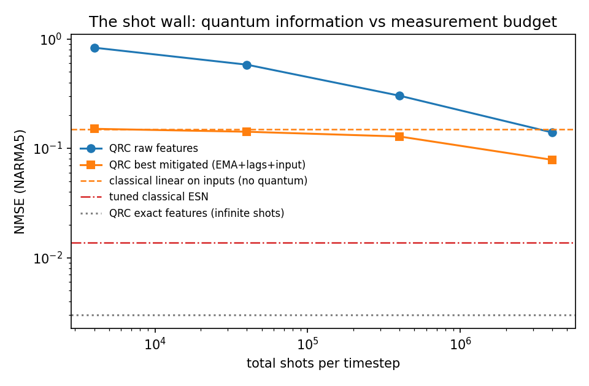

# The Shot Wall: How Measurement Noise Erases Quantum Reservoir Computing's Advantage

A small, fully reproducible benchmark study of **quantum reservoir computing (QRC)** under realistic measurement budgets — ending in a clean, quantified negative result and a redirected research question.

**TL;DR.** A 6-qubit quantum reservoir predicts a standard chaotic time-series benchmark (NARMA5) extremely well *if you could read its state perfectly* (NMSE 0.003). But quantum states are read by repeated sampling ("shots"), and at any realistic shot budget the sampling noise erases essentially **all** of the quantum features' added value — eight different mitigation strategies all plateau at the accuracy a classical linear model gets from the raw inputs alone, with no quantum device. Closing the gap by brute force needs ~10⁹ shots per timestep, 4–5 orders of magnitude beyond practice.



## Start here

1. **New to this?** Read the two-page story: [`results/RESULTS.md`](results/RESULTS.md) (benchmark 1: QRC vs classical baselines, and why shot noise — not expressivity — is the bottleneck).
2. **Then the main result:** [`results/RESULTS_GAP.md`](results/RESULTS_GAP.md) (benchmark 2: eight gap-closing strategies, the plateau, and what it means).
3. **Want to run it?** See below — everything runs on a laptop CPU in under a minute. No quantum hardware or account needed.

## Quickstart

```bash
pip install -r requirements.txt
cd src
python qrc_benchmark.py          # benchmark 1: QRC vs tuned classical baselines  (~5 s)
python qrc_full_eval.py          # multi-seed eval + shot-noise study             (~20 s)
python qrc_gap_eval.py 40000     # benchmark 2: gap-closing strategies @ 40k shots (~6 s)
```

## What's in the box

| Path | Contents |
|---|---|
| `src/qrc_benchmark.py` | Core: 6-qubit gate-based reservoir (Qiskit unitary, reset-based input injection, Pauli-Z features, ridge readout), NARMA tasks, classical ESN + linear baselines |
| `src/qrc_full_eval.py` | Fair-comparison hardening: ESN hyperparameter grid, multi-seed error bars, finite-shot sampling |
| `src/qrc_gap_eval.py` | The gap study: PCA denoising, errors-in-variables ridge, shot reallocation across virtual nodes, sim-trained denoisers |
| `results/` | Write-ups and raw JSON numbers |
| `figures/` | Plots |

## The three findings

1. **Fair baselines matter.** QRC "beats" a classical echo state network by 14× — until you tune the ESN, after which they tie. 
2. **The shot wall.** With exact expectation values QRC is excellent; with realistic sampling, every readout-side fix (smoothing, lag stacking, PCA, noise-covariance-corrected regression, learned denoisers, shot reallocation) plateaus at the no-quantum classical baseline.
3. **The information is real but unreachable.** The reservoir's features are *not* classically redundant — neither a linear map nor an MLP can reproduce them from input history. The quantum advantage exists in the state and dies at the measurement interface.

## The redirected question

Post-processing can't fix this; the loss happens at measurement. The live question is **information-per-shot as a design criterion**: can reservoir dynamics and data encodings be designed so task-relevant signal concentrates in a few high-magnitude observables? (Secondary: tasks with coarse outputs — classification — may sit below the wall.)

## Honest limitations

Single task family (NARMA), one reservoir topology, sampling noise only — real hardware adds gate errors, so the wall here is *optimistic*. Feature-count-matched (not wall-clock-matched) classical comparisons. Details and seeds in the write-ups.

---
*Amirshayan Hamidin, 2026. Built as a scoping study for an independent-study research project.*
