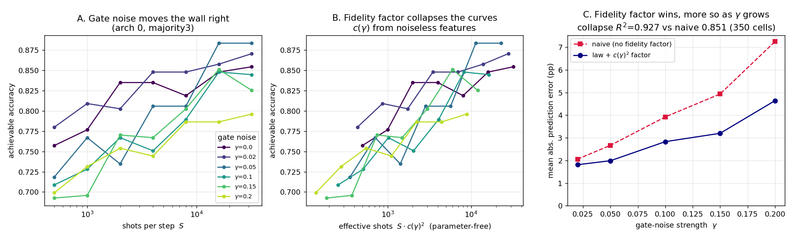
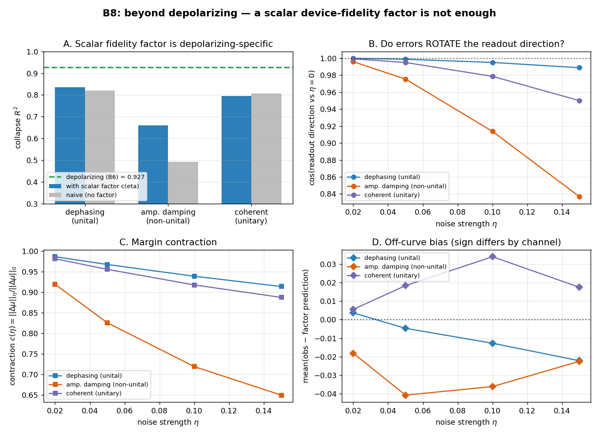
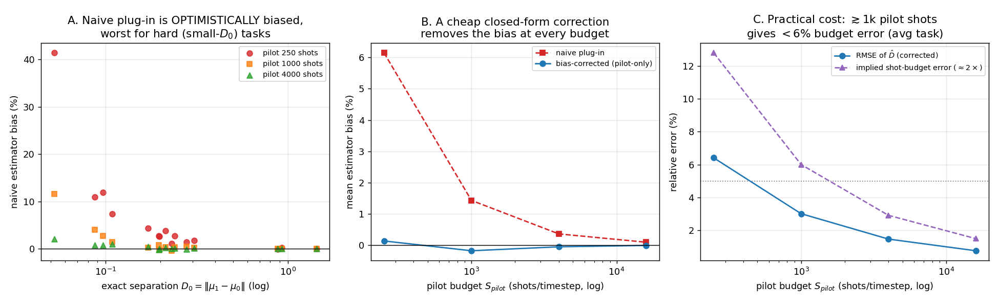
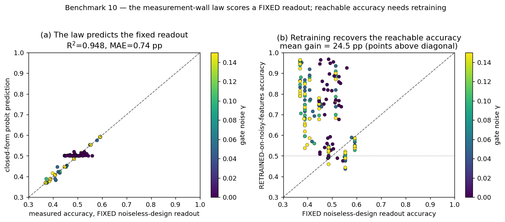
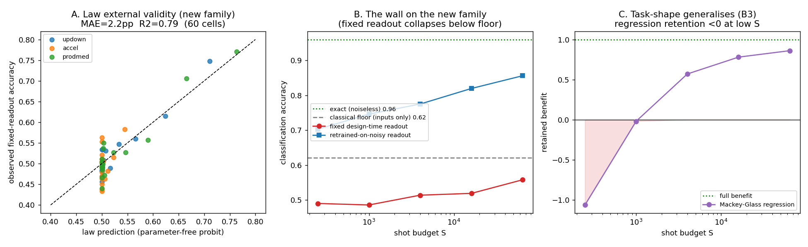
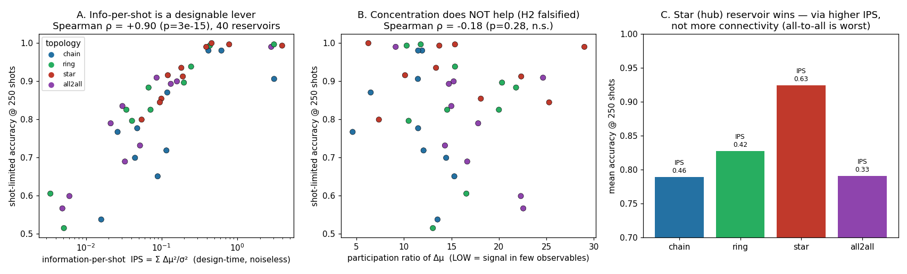
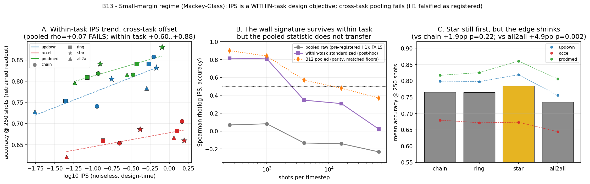

# The Shot Wall: How Measurement Noise Erases Quantum Reservoir Computing's Advantage

A small, fully reproducible benchmark study of **quantum reservoir computing (QRC)** under realistic measurement budgets — ending in a clean, quantified negative result and a redirected research question.

**TL;DR.** A 6-qubit quantum reservoir predicts a standard chaotic time-series benchmark (NARMA5) extremely well *if you could read its state perfectly* (NMSE 0.003). But quantum states are read by repeated sampling ("shots"), and at any realistic shot budget the sampling noise erases essentially **all** of the quantum features' added value — eight different mitigation strategies all plateau at the accuracy a classical linear model gets from the raw inputs alone, with no quantum device. Closing the gap by brute force needs ~10⁹ shots per timestep, 4–5 orders of magnitude beyond practice.


## Start here

1. **New to this?** Read the two-page story: [`results/RESULTS.md`](results/RESULTS.md) (benchmark 1: QRC vs classical baselines, and why shot noise — not expressivity — is the bottleneck).
2. **Then the main result:** [`results/RESULTS_GAP.md`](results/RESULTS_GAP.md) (benchmark 2: eight gap-closing strategies, the plateau, and what it means).
3. **Then the twist:** [`results/RESULTS_TASKSHAPE.md`](results/RESULTS_TASKSHAPE.md) (benchmark 3: the wall is task-shaped — classification retains ~86% of the quantum benefit at budgets where regression retains ~4%).
4. **Want to run it?** See below — everything runs on a laptop CPU in under a minute. No quantum hardware or account needed.
5. **Want the whole arc in one document?** [`PREPRINT.md`](PREPRINT.md) — the consolidated arXiv skeleton: abstract, 13-benchmark narrative, law derivation sketch, honest-negative ledger, limitations. (Related-work section pending a literature pass.) Independent verification entries live in [`AUDITS.md`](AUDITS.md) — B13 has been reproduced end-to-end from independent code.

## Quickstart

```bash
pip install -r requirements.txt
cd src
python qrc_benchmark.py          # benchmark 1: QRC vs tuned classical baselines  (~5 s)
python qrc_full_eval.py          # multi-seed eval + shot-noise study             (~20 s)
python qrc_gap_eval.py 40000     # benchmark 2: gap-closing strategies @ 40k shots (~6 s)
```

## What's in the box

| Path | Contents |
|---|---|
| `src/qrc_benchmark.py` | Core: 6-qubit gate-based reservoir (Qiskit unitary, reset-based input injection, Pauli-Z features, ridge readout), NARMA tasks, classical ESN + linear baselines |
| `src/qrc_full_eval.py` | Fair-comparison hardening: ESN hyperparameter grid, multi-seed error bars, finite-shot sampling |
| `src/qrc_gap_eval.py` | The gap study: PCA denoising, errors-in-variables ridge, shot reallocation across virtual nodes, sim-trained denoisers |
| `results/` | Write-ups and raw JSON numbers |
| `figures/` | Plots |

## The three findings

1. **Fair baselines matter.** QRC "beats" a classical echo state network by 14× — until you tune the ESN, after which they tie. 
2. **The shot wall.** With exact expectation values QRC is excellent; with realistic sampling, every readout-side fix (smoothing, lag stacking, PCA, noise-covariance-corrected regression, learned denoisers, shot reallocation) plateaus at the no-quantum classical baseline.
3. **The information is real but unreachable.** The reservoir's features are *not* classically redundant — neither a linear map nor an MLP can reproduce them from input history. The quantum advantage exists in the state and dies at the measurement interface.

## The redirected question

Post-processing can't fix this; the loss happens at measurement. The live question is **information-per-shot as a design criterion**: can reservoir dynamics and data encodings be designed so task-relevant signal concentrates in a few high-magnitude observables?

**Benchmark 3 answered the secondary question** (`src/qrc_design.py`, [`results/RESULTS_TASKSHAPE.md`](results/RESULTS_TASKSHAPE.md)): the wall is a property of output precision, not of the quantum device. On temporal parity — where a linear model on inputs is provably at chance — the same reservoir at the same 40k-shot budget keeps 93% accuracy (86% of its exact-readout benefit), crossing the tuned classical ESN near 12k shots/step. Shot noise destroys precision, not information class: coarse-output tasks sit below the wall.

## Latest: benchmarks 5–6 (a predictive law, and its hardware extension)

**Benchmark 5 — a parameter-free measurement-wall law** (`results/RESULTS_LAW.md`). Across 150 cells (5 tasks × 6 architectures × 5 shot budgets), a shot-noise-limited QRC classifier's accuracy is predicted *before any noisy run* from three noiseless quantities — readout direction, per-sample decision margins, and the exact multinomial shot-noise covariance projected onto the readout — at R² = 0.991, MAE 1.3 pp, with zero fitted parameters.

**Benchmark 6 — a device-fidelity factor** (`results/RESULTS_GATENOISE.md`). The law is extended from shot noise to *gate* noise. A global depolarizing channel contracts every decision margin by a noiselessly-computable factor `c(γ)`, so gate noise acts, to leading order, as a pure effective-shot reduction: rescaling the shot axis by `c(γ)²` collapses every gate-noisy accuracy curve back onto the noiseless one (420 cells, collapse R² = 0.927 vs 0.851 for ignoring gate noise, advantage growing with noise strength). A QRC practitioner can now estimate the hardware shot budget a classification task needs — accounting for both sampling and gate fidelity — before spending any quantum time. Honest residual: the collapse is ~3 pp, not exact, so gate noise is *approximately* but not perfectly "just fewer shots." 

## Benchmarks 7–9 (probing the law's limits: a negative result, a scope boundary, and a usability test)

**Benchmark 7 — per-node + covariance refinement of the gate-noise factor** (`results/RESULTS_PERNODE.md`, *honest negative*). B6's ~3 pp residual was hypothesized to come from (i) virtual nodes seeing different noisy depths and (ii) depolarizing changing the shot-noise covariance. A parameter-free correction fixing both was pre-registered to cut collapse MAE by >30%. **It cut it by 2.5%** (2.89 → 2.82 pp). The residual is not either suspected mechanism: gate noise moves the reservoir *off* the noiseless accuracy-vs-shots curve, a small shot-budget-irreducible negative bias that no rescaling of the shot axis can remove.

**Benchmark 8 — beyond depolarizing: is the scalar factor enough?** (`results/RESULTS_BEYONDNOISE.md`). B6's clean `S_eff = S·c²` collapse used global *depolarizing* noise — the most favourable case, where every readout feature is multiplied by the same scalar. Against three physically distinct channels the scalar factor falls short of its R²=0.927 depolarizing benchmark on all of them (dephasing 0.90, amplitude-damping/coherent worse), and none clears the pre-registered R²>0.9 bar. The mechanism separates cleanly: **coherent (unitary) errors *rotate* the readout direction** — information-preserving, largely recovered by a retrained readout, so the scalar factor has the wrong sign — while **non-unital amplitude damping (T₁) is the genuinely shot-irreducible case.** For hardware, relaxation matters more than coherent/calibration error under a fixed shot budget. 

**Benchmark 9 — can the law be used at scale?** (`results/RESULTS_MARGINEST.md`). The law needs the design-time separation `D₀ = ‖μ₁−μ₀‖`, computed on the *noiseless* reservoir — impossible at unsimulable sizes, where it must be *estimated* from a pilot run. The obvious plug-in `‖μ̂₁−μ̂₀‖` is **optimistically biased** (shot noise inflates each class mean), worst exactly where it hurts: up to **+41%** on the hardest low-margin task at a 250-shot pilot, which would badly under-budget the shots needed to clear the wall. A parameter-free correction subtracting the pilot-estimated shot-noise variance removes the bias to ≤0.8% at every budget using only the same pilot data, recovering `D₀` to ~3% RMSE at 1,000 pilot shots (≈6% predicted-budget error). The margin-based budgeting recipe survives the transition from *computing* margins to *estimating* them — with a stated price and a named trap. 

**Benchmark 10 — the law scores a *fixed* readout; reachable accuracy needs retraining** (`results/RESULTS_RETRAIN.md`). The B5/B6 prediction takes the readout trained on *noiseless* features. That closed-form probit turns out to be an almost-exact model of that **fixed** design readout run on a noisy device (R²=0.948, MAE 0.74 pp; 0.14 pp on the gate-noisy cells) — but the fixed readout is not noise-robust: in the perfect-exact-separation regime it collapses a mean **24.5 pp** below the accuracy reachable by **retraining** the linear readout on the noisy features. **99.5%** of the law-vs-reachable residual is exactly this retraining gain (per-cell correlation −0.9997). So the measurement-wall law is really a *retrained*-readout law, and retraining on-device is load-bearing rather than a side effect. Honest caveat: this is the maximal-collapse regime (exact accuracy ≈ 1.00); an encoding-gain sweep is queued to map how the fixed/retrained gap closes as exact separation degrades. 

## Benchmark 11 (external validity: a second, independent task family)

**Benchmark 11 — does the wall and the law survive leaving the parity/NARMA family?** (`results/RESULTS_TASKFAM.md`). Every result above uses one binary input stream. B11 swaps the whole family — a continuous chaotic **Mackey-Glass** drive with three balanced, non-parity, memory-dependent classification tasks plus one-step-ahead chaotic regression (4 architectures × 5 budgets, 60 clf + 20 reg cells) — and changes nothing else. Three pre-registered findings: **(H1)** the wall reproduces and is *harsher* — the fixed design-time readout collapses to ≈0.56 accuracy at 64k shots, *below* the inputs-only classical floor (0.62), because these tasks separate exactly but on razor-thin margins; **(H2)** the parameter-free B5/B6 probit stays calibrated on the unseen family (MAE **2.2 pp**, near-zero bias, and it correctly predicts both the near-chance collapse and the one architecture that recovers), but the pre-registered R²>0.9 bar **fails at 0.79** — reported, not moved — because the new tasks' accuracies cluster near chance (3× less variance than parity, so a small error eats more of it; the two signal-bearing tasks give R²≈0.87–0.89); **(H3)** Mackey-Glass regression retention goes *negative* at 250 shots and climbs to 0.86 by 64k, the same task-shape signature as NARMA. B11 also independently reproduces B10 on this new family: retraining on noisy features recovers 0.56→0.86 at 64k. 

## Benchmark 12 (answering the redirected question: is information-per-shot designable?)

**Benchmark 12 — reservoir topology sweep** (`results/RESULTS_TOPOLOGY.md`). The whole program used one coupling graph; B12 sweeps it (chain / ring / star / all-to-all × depth 1–2) on the five classification tasks, holding qubits, injection, nodes, features and readout fixed (200 cells; exact-readout accuracy = 1.00 for all 40 reservoirs, a clean matched-accuracy setting). Two design-time noiseless quantities: **IPS** = Σ Δμ²/σ² (class-discrimination SNR² *per shot*) and **PR** = participation ratio of the separation (low = signal in few observables). **(H1) confirmed — information-per-shot is a real, designable lever:** IPS varies **14–56×** across topologies and predicts shot-limited accuracy at Spearman **ρ = +0.90** at 250 shots (fading to +0.37 by 64k as accuracy saturates). The **star (hub) reservoir wins** (0.924 acc @250 vs 0.79 for chain/all-to-all) — and wins *through* higher IPS, not connectivity: all-to-all has the most couplings but the lowest IPS and worst-tied accuracy. **(H2) falsified (honest negative) — concentration is the wrong target:** PR is uncorrelated with accuracy (ρ = −0.18, p = 0.28) and with IPS. So the redirected question's literal phrasing ("concentrate signal in a *few* high-magnitude observables") points at the wrong quantity; the knob is **total SNR² per shot summed over all observables**, a noiselessly computable design objective — maximise it (e.g. via a hub topology), don't chase sparsity. 

## Benchmark 13 (stress-testing B12's design rule where the margins are thin)

**Benchmark 13 — the small-margin regime sweep** (`results/RESULTS_SMALLMARGIN.md`, *honest negative at the registered bar*). B12's headline numbers came from parity's maximal-headroom regime (exact = 1.00, matched floors). B13 re-runs the identical 8-reservoir topology sweep on B11's razor-thin-margin **Mackey-Glass** classification tasks (120 cells; pipeline verified by reproducing B12's published IPS to machine precision). **The pre-registered pooled claim fails outright:** ρ(log IPS, accuracy) = **+0.07** (p = 0.75) at 250 shots vs B12's +0.90 — reported, not moved. Post-hoc diagnosis (labeled as such): the effect survives *within* each task (ρ = +0.60…+0.88 at 250 shots; within-task-standardized pooled ρ = **+0.82**, p < 10⁻⁴, decaying to +0.02 at 64k — B12's wall signature exactly), but IPS is **not comparable across tasks** with different floors and difficulty, so B12's pooled correlation was partly a gift of the parity family's uniformity. Corrected scope: **IPS is a within-task design objective** — the use case a designer actually has — not a task-transferable score. The star advantage also shrinks: still first (0.784), but only +1.9 pp over chain/ring (n.s., p ≈ 0.1–0.2), while **"all-to-all is worst" transfers robustly** (+4.9 pp, p = 0.002; most couplings, least information per shot, in both regimes). Depth-2 scrambling collapses IPS 3–29× on these thin-margin tasks. 

## Honest limitations

Two task families tested (binary parity/NARMA and continuous Mackey-Glass; B11) and a topology sweep in both margin regimes (B12 maximal-headroom, B13 small-margin), but still 5–6 qubits, one injection scheme, one reservoir-parameter seed for the topology sweeps, sampling plus the gate-noise channels of B6–B8 — real hardware adds crosstalk and drift, so the wall here is *optimistic*. B13's within-task rescue of the IPS rule is post-hoc and needs a confirmatory third family. Feature-count-matched (not wall-clock-matched) classical comparisons. Details and seeds in the write-ups.

---
*Amirshayan Hamidin, 2026. Built as a scoping study for an independent-study research project.*
