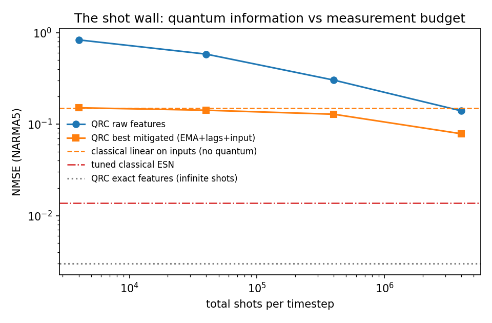
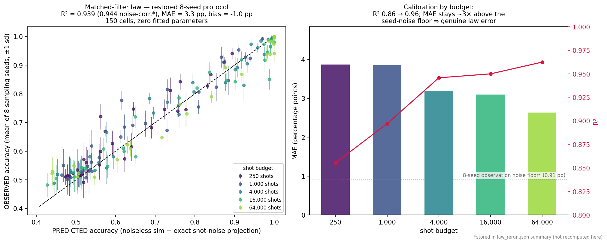

# Measurement-limited quantum reservoir computing: benchmarks, a predictive law, and design rules

A reproducible benchmark study of quantum reservoir computing (QRC) under finite measurement budgets. The central result is a quantified negative: at realistic shot counts, sampling noise removes essentially all of the accuracy advantage a small gate-based quantum reservoir holds over tuned classical baselines on precise-output (regression) tasks. The results that follow from it are constructive: the loss depends on task type in a predictable way, noisy accuracy can be forecast before any noisy run by a closed-form law with no fitted parameters, and the per-shot information content of a reservoir is a computable design objective.

Everything runs on a laptop CPU in seconds to minutes; no quantum hardware account is required to reproduce any number. The study comprises thirteen benchmarks (B1–B13), each pre-registered with a falsifiable hypothesis and numeric success criteria; six hypotheses were falsified and are reported as failures.



## Findings

**Baselines and the wall (B1–B2).** An untuned classical echo state network (ESN) loses to the 6-qubit reservoir by 14×; after a standard hyperparameter search the two tie, and every comparison below uses the tuned baseline ([`results/RESULTS.md`](results/RESULTS.md)). With exact expectation values the reservoir reaches NMSE 0.003 on the NARMA5 benchmark. Under multinomial sampling, eight readout-side mitigation strategies — temporal smoothing, lag stacking, PCA denoising, errors-in-variables ridge regression with the analytic noise covariance, learned denoisers, and shot reallocation across virtual nodes — all plateau at the accuracy of a classical linear model on the raw inputs that uses no quantum device (NMSE 0.142 vs 0.148 at 40,000 shots/timestep). Closing the gap by averaging alone would require ~10⁹ shots per timestep, four to five orders of magnitude beyond practice ([`results/RESULTS_GAP.md`](results/RESULTS_GAP.md)). The buried information is real: the reservoir's memory content — its dependence on past inputs — cannot be linearly reconstructed from the input history (relative error 0.86; the full feature vector, current input included, largely can be, 0.13). The advantage exists in the state and is lost at the measurement interface, which is why post-processing cannot recover it.

**Task dependence (B3).** The wall is a property of output precision, not of the device. On temporal parity-3 — where a linear model on the inputs is provably at chance — the same reservoir at the same 40k-shot budget reaches 93% accuracy, retaining 86% of its exact-readout benefit, and crosses the tuned ESN (77%) near 12k shots/step; NARMA regression at the same budget retains ~4% ([`results/RESULTS_TASKSHAPE.md`](results/RESULTS_TASKSHAPE.md); the raw file behind the accuracy curve is undergoing a pre-registered generator reconstruction, see [`AUDITS.md`](AUDITS.md)). Coarse-output tasks — classification, detection, decision — sit below the wall; precise trajectory regression sits above it.

**A predictive law (B5), consistent with hardware (B4).** Noisy classifier accuracy can be computed before any noisy run from three noiseless quantities: the trained readout direction, per-sample decision margins, and the multinomial shot-noise covariance projected onto the readout. Across 150 cells (5 tasks × 6 architectures × 5 shot budgets), prediction matches observation at R² = 0.939 (0.944 after correcting for observation sampling noise), MAE 3.3 pp, bias −1.0 pp, with zero fitted parameters; per-budget R² rises from 0.86 at 250 shots to 0.96 at 64k ([`results/RESULTS_LAW.md`](results/RESULTS_LAW.md)). A single physical run on ibm_marrakesh (0.886 accuracy at 6,000 shots) landed at the predicted shot-noise ceiling. Provenance note: the originally reported precision (R² = 0.991, MAE 1.3 pp) did not survive an independent audit; the numbers quoted here regenerate from the committed prediction generator re-run at 8 documented sampling seeds per cell ([`AUDITS.md`](AUDITS.md)).



**Gate noise as an effective shot reduction (B6–B8).** A global depolarizing channel contracts every decision margin by a noiselessly computable factor c(γ), so to leading order gate noise acts as a shot-budget rescaling S → S·c(γ)²: the rescaling collapses all 420 gate-noisy accuracy curves onto the noiseless curve at R² = 0.927, versus 0.851 if gate noise is ignored ([`results/RESULTS_GATENOISE.md`](results/RESULTS_GATENOISE.md)). Two limits are mapped. A pre-registered refinement predicted to cut the ~3 pp collapse residual by more than 30% delivered 2.5% (2.89 → 2.82 pp): the residual is shot-irreducible (B7, [`results/RESULTS_PERNODE.md`](results/RESULTS_PERNODE.md)). And the scalar factor degrades for non-depolarizing channels (dephasing R² = 0.90, amplitude damping and coherent errors lower): coherent errors rotate the readout direction and are largely recovered by retraining, while amplitude damping (T₁) is the genuinely shot-irreducible case (B8, [`results/RESULTS_BEYONDNOISE.md`](results/RESULTS_BEYONDNOISE.md)).

**Using the law at scale (B9–B10).** Beyond simulable sizes, the law's design-time class separation must be estimated from a pilot run. The naive estimator is optimistically biased — up to +41% at a 250-shot pilot on the hardest task, exactly where under-budgeting hurts most — and a parameter-free correction removes the bias to ≤0.8% at every budget, recovering the separation to ~3% RMSE at 1,000 pilot shots (≈6% error in the predicted budget; [`results/RESULTS_MARGINEST.md`](results/RESULTS_MARGINEST.md)). The closed-form prediction scores a fixed design-time readout almost exactly (R² = 0.948, MAE 0.74 pp), but that readout is not noise-robust: retraining the linear readout on noisy features recovers a mean 24.5 pp in the maximal-collapse regime (exact separation ≈ 1, which holds for 4 of 10 architecture–task pairs), and 99.5% of the fixed-vs-reachable gap is the retraining gain ([`results/RESULTS_RETRAIN.md`](results/RESULTS_RETRAIN.md)).

**External validity and design (B11–B13).** On an independent Mackey-Glass task family, with nothing else changed, the wall reproduces and is harsher — the fixed design-time readout falls to ≈0.56 accuracy at 64k shots, below the 0.62 classical floor, because these tasks separate exactly but on thin margins — while the law stays calibrated with no refit (MAE 2.2 pp; the pre-registered R² > 0.9 bar failed at 0.79 and is reported as failed), and readout retraining again rescues accuracy, 0.56 → 0.86 at 64k ([`results/RESULTS_TASKFAM.md`](results/RESULTS_TASKFAM.md)). A topology sweep identifies information-per-shot, IPS = Σ Δμ²/σ², as a designable objective: it varies 14–56× across coupling graphs and predicts shot-limited accuracy at Spearman ρ = +0.90 at 250 shots (fading to +0.37 by 64k as accuracy saturates); a hub (star) topology performs best and all-to-all coupling worst, and the pre-registered concentration hypothesis was falsified — the participation ratio of the separation is uncorrelated with accuracy (ρ = −0.18; [`results/RESULTS_TOPOLOGY.md`](results/RESULTS_TOPOLOGY.md)). A stress test on the thin-margin family corrected the rule's scope: the pooled correlation collapses (ρ = +0.07, p = 0.75) because IPS magnitudes are not comparable across tasks, but the effect survives within each task (ρ = +0.60 to +0.88 at 250 shots; within-task-standardized pooled ρ = +0.82, decaying to +0.02 at 64k), "avoid all-to-all" transfers robustly (+4.9 pp, p = 0.002), and the star advantage shrinks to a non-significant +1.9 pp ([`results/RESULTS_SMALLMARGIN.md`](results/RESULTS_SMALLMARGIN.md)).

## Reproducing the results

```bash
pip install -r requirements.txt
cd src
python qrc_benchmark.py          # B1: QRC vs tuned classical baselines     (~5 s)
python qrc_full_eval.py          # multi-seed evaluation + shot-noise study (~20 s)
python qrc_gap_eval.py 40000     # B2: mitigation strategies at 40k shots   (~6 s)
```

Each write-up in `results/` names its generating script and seeds; raw per-cell values are stored as JSON alongside the write-ups.

## Repository layout

| Path | Contents |
|---|---|
| `src/qrc_benchmark.py` | Core: 6-qubit gate-based reservoir (unitary evolution, reset-based input injection, Pauli-Z features, ridge readout), NARMA tasks, classical ESN and linear baselines |
| `src/qrc_full_eval.py` | Fair-comparison hardening: ESN hyperparameter grid, multi-seed error bars, finite-shot sampling |
| `src/qrc_gap_eval.py` | Mitigation-strategy comparison at fixed shot budget (B2) |
| `src/` (remainder) | Per-benchmark generators for B3–B13; each write-up names its script |
| `results/` | Write-ups (`RESULTS_*.md`) and raw JSON |
| `figures/` | Plots |
| `audits/` | Audit runners, pre-registrations, and a replication study of published ML claims (see below) |

## Verification

Published numbers are re-executed from the committed code in recurring audit passes, logged in [`AUDITS.md`](AUDITS.md) with reproduced and published values side by side. Most benchmark outputs regenerate byte-identically. Where an audit found a published number it could not regenerate — the original B5 headline precision, two B2 table rows, and a B2 redundancy probe — the finding is disclosed in the audit log, and the number was subsequently either restored from a committed pinned-convention generator or corrected in place; one reconstruction (the B3 accuracy curve) is currently in progress. A consolidated draft write-up is in [`PREPRINT.md`](PREPRINT.md), with literature positioning in [`RELATED_WORK.md`](RELATED_WORK.md).

The repository also hosts a separate pre-registered replication study of published machine-learning claims: across 31 replication audits (67 pre-scored points), blind-scored implementation discretion predicts reproducibility drift at Spearman ρ = 0.587, p = 1.7×10⁻⁷ ([`results/RESULTS_DRIFT.md`](results/RESULTS_DRIFT.md)).

## Limitations

Two task families (binary parity/NARMA and continuous Mackey-Glass); 4–6 qubits; one input-injection scheme; one reservoir-parameter seed for the topology sweeps; sampling noise plus the gate-noise channels of B6–B8 only — real hardware adds crosstalk and drift, so the wall reported here is optimistic. The within-task form of the IPS design rule is post-hoc and needs a confirmatory third task family. Classical comparisons are feature-count matched, not wall-clock matched. Per-benchmark caveats, seeds, and raw data are in `results/`.

## Methods and provenance

The experiments, analyses, and first drafts in this repository were produced with substantial assistance from an AI research agent operating under the verification protocol in [`PROTOCOL.md`](PROTOCOL.md): hypotheses and numeric success criteria committed before data, negative results published with the same prominence as positive ones, and every published number either regenerated from committed code in audit or explicitly flagged and corrected. Under the protocol's sign-off rule, no claim leaves this repository for external publication without the named author's review. The audit history, including discrepancies found and corrected, is preserved in [`AUDITS.md`](AUDITS.md) and the commit record.

---
*Amirshayan Hamidin, 2026. Independent-study research project. Contact: hamideinamirshayan@gmail.com*
